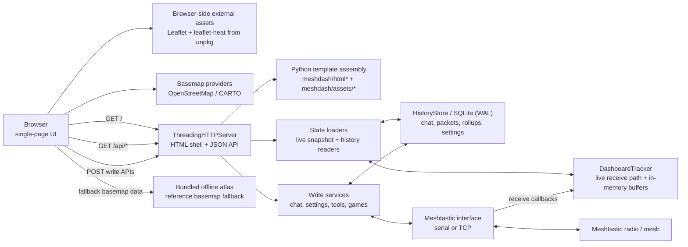

# Meshyface Public (core-ui)

Meshyface is a chat-first Meshtastic dashboard that runs as a single Python
service and serves a single-page web UI over HTTP.

This branch (`release/public-v0`) is the curated public surface. In this branch,
the shipped frontend is the curated `core-ui` surface.

## Current Public Surface

Public `core-ui` currently exposes:

- Chat workspace for `Everyone` plus direct-peer conversations
- Network workspace for map, topology, node details, and on-demand history views
- Console workspace for live packet/log output
- Apps workspace with Games, plus a Files tab when file transfer is enabled
- Settings workspace with radio, device, connectivity, location, channels,
  tickers, lists, appearance, and about panes
- SQLite-backed history, search, rollups, theme persistence, and custom
  telemetry rule persistence

Not part of the supported public launcher surface:

- Dedicated Bots or Labs launcher views
- Alternate UI profiles such as `full` or `labs-preview`

The source tree still contains optional/private modules and dormant template
sections used by other branches or slim builds. If an optional backend handler
is missing, the corresponding endpoint returns `503`.

## System Architecture



Key runtime notes:

- `mesh_dashboard.py` owns CLI/env parsing, file-transfer safety validation,
  default-gateway fallback, and startup mode selection.
- `mesh_connection.py` opens either a Meshtastic serial interface or TCP
  interface.
- The live receive path updates `DashboardTracker` and the in-memory state used
  by `/api/state`.
- `HistoryStore` persists packets, chat, node analytics, connection events,
  summary rollups, and custom telemetry settings to SQLite using WAL mode for
  concurrent reads and writes.
- The browser polls `/api/state`, fetches history/detail endpoints on demand,
  and POSTs write actions for chat, settings, tools, and optional apps.
- When online map tiles fail, the UI can fall back to the bundled offline atlas
  reference layers. The current public build still expects Leaflet JS/CSS to be
  reachable from `unpkg.com` unless you vendor or proxy those assets yourself.

## Requirements

- Linux host strongly recommended for server mode
  - Debian-based hosts such as Raspberry Pi OS Bookworm work with the bundled
    deploy helper
- Python 3.11+
- Meshtastic-accessible radio over either:
  - TCP (`--mesh-host` + `--mesh-tcp-port`)
  - Serial USB (`--mesh-port`)
- Python packages:
  - `meshtastic`
  - `pypubsub`
  - `protobuf`
- Browser access to:
  - `https://unpkg.com/leaflet@1.9.4/...`
  - `https://unpkg.com/leaflet.heat@0.2.0/...`
  - map tile providers if you want online basemaps

For a fully air-gapped deployment, plan to vendor/proxy the Leaflet assets and
accept that the map will use the bundled offline atlas when tile servers are
unavailable.

## Repository Layout

- `mesh_dashboard.py` - entrypoint, CLI/env parsing, startup mode selection
- `mesh_connection.py` - Meshtastic TCP/serial connection handling
- `meshdash/assets/` - HTML/CSS/JS template fragments for the single-page UI
- `meshdash/html*.py` - frontend asset assembly
- `meshdash/http*.py`, `meshdash/api*.py` - HTTP routing and API handlers
- `meshdash/tracker*.py` - receive path, live packet tracking, in-memory state
- `meshdash/history*.py`, `meshdash/history/` - SQLite schema, reads, writes,
  analytics, rollups, pruning
- `scripts/deploy_meshyface.sh` - remote deploy/bootstrap helper
- `scripts/release_public.sh` - allowlist-driven public release packager
- `tests/` - public-branch regression tests included in this repo

## Standalone Install

### 1) Clone + venv

```bash
git clone <your-repo-url> meshyface
cd meshyface
python3 -m venv .venv
source .venv/bin/activate
python -m pip install --upgrade pip
python -m pip install meshtastic pypubsub protobuf
```

### 2A) Run with Wi-Fi/TCP radio

```bash
python mesh_dashboard.py \
  --mesh-host 192.168.1.69 \
  --mesh-tcp-port 4403 \
  --http-host 0.0.0.0 \
  --http-port 8877 \
  --refresh-ms 3000
```

### 2B) Run with USB serial radio

```bash
python mesh_dashboard.py \
  --mesh-port /dev/ttyACM0 \
  --http-host 0.0.0.0 \
  --http-port 8877 \
  --refresh-ms 3000
```

Tip: use `/dev/serial/by-id/...` for a stable serial path when possible.

### 2C) Optional: shared TCP gateway fallback

If you want the dashboard to prefer a shared TCP radio when `--mesh-host` is
not supplied and the serial path is left at its default value:

```bash
export MESH_GATEWAY_HOST=192.168.1.69
export MESH_GATEWAY_PORT=4403
python mesh_dashboard.py
```

Disable that fallback explicitly with:

```bash
python mesh_dashboard.py --no-default-gateway
```

### 3) Open UI

- Local: `http://127.0.0.1:8877`
- LAN: `http://<host-ip>:8877`

Run `python mesh_dashboard.py --help` for the authoritative runtime flag list.

## Data And Storage

### Profiled history databases

`--history-db` is the base path, not always the final on-disk filename.

At startup the dashboard derives a profile key from the connected radio,
preferring the local node id when available, and then rewrites the DB path to:

```text
<base>.radio-<profile-key>.sqlite3
```

Examples:

- `mesh_dashboard_history.sqlite3` ->
  `mesh_dashboard_history.radio-02ed9b7c.sqlite3`
- `mesh_dashboard_history.sqlite3` ->
  `mesh_dashboard_history.radio-192-168-1-69-4403-tcp.sqlite3`

This allows multiple radios to share one base path without trampling each
other's history.

### History modes

- Default mode persists chat, packets, connection events, node analytics,
  malformed-text records, environment metrics, and summary rollups to SQLite.
- `--no-history` disables the persistent store and keeps only live in-memory
  buffers.
- Summary rollups are also sampled in the background while the dashboard is
  running when history is enabled.

### Theme and local settings

- Theme preset selection persists to
  `mesh_dashboard_theme_settings.json` by default, or the file supplied via
  `--theme-settings-file`.
- Custom telemetry rules are stored in the history SQLite database.

### One-shot backfill mode

To rebuild environment rollups from already-saved packet history:

```bash
python mesh_dashboard.py \
  --history-db mesh_dashboard_history.sqlite3 \
  --backfill-environment-rollups
```

To clear existing rollups first:

```bash
python mesh_dashboard.py \
  --history-db mesh_dashboard_history.sqlite3 \
  --backfill-environment-rollups \
  --backfill-environment-rollups-reset
```

If you pass the base history path and multiple profiled DBs exist, backfill
selects the most recently modified matching profiled DB.

## Links View Semantics

The `Links` subview is a topology view, not a packet-route replay.

- `History` mode draws from the stored link history saved in SQLite.
- `Live` mode draws from current-session link observations only.
- The numbered rings show shortest graph distance from the current root using a
  breadth-first search over the observed link graph.
- Those ring numbers are not literal Meshtastic forwarding hops and are not a
  real-time packet trace.
- Packet-hop metadata, when available, is still shown separately in node or
  edge details as packet-hop values.

The current root is the node the graph is centered around. Selecting a
different node changes the root and recomputes the numbered distance rings from
that node.

## Proxmox And Service Deployment

You have two common deployment models:

1. Proxmox VM/LXC + radio reachable over LAN (TCP) - simplest and most stable
2. Proxmox VM/LXC + USB radio passthrough (serial) - works, but needs device
   passthrough

### Recommended: Proxmox with TCP radio

If your radio is on Wi-Fi/Ethernet and exposes TCP (usually `4403`), run the
dashboard in a VM or container and connect over network.

#### Fast bootstrap/deploy from your workstation

From this repo:

```bash
./scripts/deploy_meshyface.sh \
  --target j@192.168.1.241 \
  --bootstrap \
  --mesh-host 192.168.1.69 \
  --mesh-port 4403 \
  --clean-app-dir
```

This installs the runtime, deploys app files, writes `dashboard.env`, and
restarts the service.

Bootstrap assumptions:

- target host has `apt-get`, `systemd`, `ssh`, and `sudo`
- target Python must be `3.11+` after bootstrap; Raspberry Pi OS Bookworm is a
  good baseline
- when you do not override `MESH_DASH_DEPLOY_ROOT`, the deploy helper now uses
  the remote login user's home and installs under `<remote-home>/mesh`
- the generated service unit uses the remote login user by default and keeps
  `dialout` as the default service group for serial-access-friendly installs

Important naming note:

- In the runtime CLI, the TCP radio port flag is `--mesh-tcp-port`.
- In `scripts/deploy_meshyface.sh` and the bundled `dashboard.env`,
  `MESH_PORT` is the TCP port for historical reasons.

#### Update loop

```bash
./scripts/deploy_meshyface.sh \
  --target j@192.168.1.241 \
  --mesh-host 192.168.1.69 \
  --mesh-port 4403 \
  --clean-app-dir
```

#### Full reset + redeploy

If you want to remove the current Meshyface install on the target and rebuild it
from scratch in one step, use `--wipe-remote-root`. This removes the managed
systemd unit plus the deploy root, then bootstraps fresh:

```bash
./scripts/deploy_meshyface.sh \
  --target j@192.168.1.121 \
  --wipe-remote-root \
  --serial-path /dev/serial/by-id/usb-Silicon_Labs_CP2102_USB_to_UART_Bridge_Controller_0001-if00-port0
```

`--wipe-remote-root` implies `--bootstrap`.

#### Full uninstall + hard reboot

If you want to remove Meshyface from the Pi and stop there:

```bash
./scripts/deploy_meshyface.sh \
  --target j@192.168.1.121 \
  --uninstall \
  --hard-reboot
```

That removes:

- `/etc/systemd/system/meshtastic-dashboard.service`
- the managed deploy root, which defaults to `/home/<ssh-user>/mesh`
- any managed app/config/log/venv/history paths that were explicitly configured
  outside the deploy root

`--hard-reboot` can also be used after a normal deploy if you want the host to
come back from a forced reboot instead of just restarting the service.

#### Raspberry Pi target

For a Raspberry Pi running Raspberry Pi OS Bookworm or newer, the same
bootstrap flow works as long as the SSH user has `sudo` access:

```bash
./scripts/deploy_meshyface.sh \
  --target pi@raspberrypi.local \
  --bootstrap \
  --mesh-host 192.168.1.211 \
  --mesh-port 4403 \
  --clean-app-dir
```

That will default to:

- app root: `/home/pi/mesh`
- service user: `pi`
- service group: `dialout`

If the Pi has a radio attached over USB serial instead of TCP, use the stable
`/dev/serial/by-id/...` path:

```bash
./scripts/deploy_meshyface.sh \
  --target pi@raspberrypi.local \
  --bootstrap \
  --serial-path /dev/serial/by-id/usb-Silicon_Labs_CP2102_USB_to_UART_Bridge_Controller_0001-if00-port0 \
  --clean-app-dir
```

### Proxmox with USB serial radio

#### VM path

- In Proxmox GUI: VM -> Hardware -> Add -> USB Device
- Boot VM and confirm device appears:

```bash
ls -l /dev/ttyACM* /dev/ttyUSB* 2>/dev/null
ls -l /dev/serial/by-id 2>/dev/null
```

#### LXC path (advanced)

For LXC, pass the serial device from host into the container config. Typical
pattern:

- allow the character device
- bind-mount `/dev/ttyACM0` or `/dev/ttyUSB0` into the container

After passthrough, verify the same `ls` commands inside the container.

### Run as systemd service (TCP)

The included `meshtastic-dashboard.service` is an example service file for a
host laid out under `/home/j/mesh`. Adjust `User`, `Group`, paths, and serial
permissions to match your host.

The bootstrap path in `scripts/deploy_meshyface.sh` does not copy that example
verbatim anymore. It renders a host-specific unit from the resolved deploy
settings, including the remote root, app/config paths, venv path, service user,
and service group.

It reads env from `/home/j/mesh/config/dashboard.env`.

Example env:

```bash
cat > /home/j/mesh/config/dashboard.env <<'EOF_ENV'
MESH_HOST=192.168.1.69
MESH_PORT=4403
DASH_HOST=0.0.0.0
DASH_PORT=8877
REFRESH_MS=3000
MESH_DASH_HISTORY_DB=/home/j/mesh/mesh_dashboard_history.sqlite3
MESH_DASH_FILE_TRANSFER_ENABLE=0
MESH_DASH_FILE_TRANSFER_MAX_BYTES=65536
MESH_DASH_ACCEPT_FILE_TRANSFER_TRAFFIC_DISCLAIMER=0
PYTHONUNBUFFERED=1
EOF_ENV
```

Start/restart:

```bash
sudo systemctl daemon-reload
sudo systemctl enable --now meshtastic-dashboard
sudo systemctl restart meshtastic-dashboard
sudo systemctl status meshtastic-dashboard --no-pager
```

### Run as systemd service (serial)

For serial mode, override `ExecStart` to use `--mesh-port` instead of
`--mesh-host`.

Quick override:

```bash
sudo systemctl edit meshtastic-dashboard
```

Drop-in contents:

```ini
[Service]
ExecStart=
ExecStart=/home/j/mesh/.venv/bin/python /home/j/mesh/app/mesh_dashboard.py --mesh-port /dev/ttyACM0 --http-host ${DASH_HOST} --http-port ${DASH_PORT} --refresh-ms ${REFRESH_MS}
```

Then:

```bash
sudo systemctl daemon-reload
sudo systemctl restart meshtastic-dashboard
```

Also ensure the service user can access the serial device, usually via the
`dialout` group.

### File transfer safety gate

File transfer is hidden/disabled by default. To enable it you must set both:

- `--file-transfer-enable` or `MESH_DASH_FILE_TRANSFER_ENABLE=1`
- `--accept-file-transfer-traffic-disclaimer` or
  `MESH_DASH_ACCEPT_FILE_TRANSFER_TRAFFIC_DISCLAIMER=1`

Optional size cap:

- `--file-transfer-max-bytes <bytes>` or
  `MESH_DASH_FILE_TRANSFER_MAX_BYTES=<bytes>`
- Valid range is clamped to `1024` .. `512000` bytes

Deploy helper example:

```bash
./scripts/deploy_meshyface.sh \
  --target j@192.168.1.241 \
  --mesh-host 192.168.1.69 \
  --file-transfer-enable \
  --file-transfer-max-bytes 512000 \
  --accept-file-transfer-traffic-disclaimer \
  --clean-app-dir
```

`scripts/deploy_meshyface.sh` preserves existing file-transfer env values from
the target `dashboard.env` unless you explicitly pass file-transfer flags or
env overrides.

## Configuration Reference

### Connection and transport

- `--mesh-host <ip-or-dns>`: TCP radio host
- `--mesh-tcp-port <port>`: TCP radio port, default `4403`
- `--mesh-port <path>`: serial device path
- `--default-gateway-host <host>`: fallback TCP host if `--mesh-host` is not
  provided and serial is still on the default path
- `--default-gateway-port <port>`: fallback TCP port for
  `--default-gateway-host`
- `--no-default-gateway`: force serial unless `--mesh-host` is explicitly set

Related environment variables:

- `MESH_GATEWAY_HOST`
- `MESH_GATEWAY_PORT`
- `MESH_DASH_MESH_PORT` for the default serial path

### HTTP, UI, and security

- `--http-host <host>`: bind host, default `0.0.0.0`
- `--http-port <port>`: bind port, default `8877`
- `--refresh-ms <ms>`: browser poll interval, default `3000`
- `--packet-limit <n>`: recent live packet buffer size, default `250`
- `--reset-ticker-scale-on-restart` /
  `--no-reset-ticker-scale-on-restart`
- `--show-secrets`: reveal private keys/passwords/PSKs in raw JSON panels
- `--private-mode` / `--no-private-mode`: strip public chat slices and block
  selected public endpoints
- `--api-token <token>`: require auth on write endpoints via
  `Authorization: Bearer <token>` or `X-API-Token`

Related environment variables:

- `MESH_DASH_PRIVATE_MODE`
- `MESH_DASH_API_TOKEN`
### History and analytics

- `--history-db <path>`: base SQLite DB path
- `--history-max-rows <n>`: default `200000`
- `--history-retention-days <days>`: default `7`, use `0` to disable age
  pruning
- `--history-event-max-rows <n>`: append-only packet event cap, default
  `200000`
- `--history-event-retention-days <days>`: default `30`
- `--history-rollup-retention-days <days>`: default `365`
- `--no-history`: memory-only mode
- `--seed-from-node-db`: bootstrap live tracker from the connected radio NodeDB
- `--backfill-environment-rollups`: one-shot rollup rebuild mode
- `--backfill-environment-rollups-reset`: clear existing rollups before rebuild
- `--node-history-hours <hours>`: default selected-node window, default `72`
- `--node-history-max-points <n>`: max points returned by
  `/api/history/node`, default `1440`

Related environment variables:

- `MESH_DASH_HISTORY_DB`

### Themes

- `--theme-presets <json>`: optional custom theme preset file
- `--theme-preset <name>`: selected preset name
- `--theme-settings-file <json>`: persisted runtime theme selection file

Built-in presets:

- `default`
- `blue`

Related environment variables:

- `MESH_DASH_THEME_PRESETS`
- `MESH_DASH_THEME_PRESET`
- `MESH_DASH_THEME_SETTINGS_FILE`

### File transfer

- `--file-transfer-enable` / `--no-file-transfer-enable`
- `--file-transfer-max-bytes <bytes>`
- `--accept-file-transfer-traffic-disclaimer` /
  `--no-accept-file-transfer-traffic-disclaimer`

Related environment variables:

- `MESH_DASH_FILE_TRANSFER_ENABLE`
- `MESH_DASH_FILE_TRANSFER_MAX_BYTES`
- `MESH_DASH_ACCEPT_FILE_TRANSFER_TRAFFIC_DISCLAIMER`

### Service/deploy helper environment

The bundled service/deploy flow commonly uses:

- `MESH_HOST`
- `MESH_PORT` for the TCP radio port used by the service file
- `DASH_HOST`
- `DASH_PORT`
- `REFRESH_MS`
- `PYTHONUNBUFFERED`

The deploy helper also accepts:

- `MESH_DASH_DEPLOY_TARGET`
- `MESH_DASH_DEPLOY_ROOT`
- `MESH_DASH_DEPLOY_APP_DIR`
- `MESH_DASH_DEPLOY_CONFIG_DIR`
- `MESH_DASH_DEPLOY_LOG_DIR`
- `MESH_DASH_DEPLOY_REMOTE_VENV`
- `MESH_DASH_DEPLOY_REMOTE_PYTHON`
- `MESH_DASH_DEPLOY_SERVICE`
- `MESH_DASH_DEPLOY_SERVICE_USER`
- `MESH_DASH_DEPLOY_SERVICE_GROUP`
- `MESH_DASH_DEPLOY_CLEAN_APP_DIR`
- `MESH_DASH_DEPLOY_MESH_HOST`
- `MESH_DASH_DEPLOY_MESH_PORT`
- `MESH_DASH_DEPLOY_SERIAL_PATH`
- `MESH_DASH_DEPLOY_DASH_HOST`
- `MESH_DASH_DEPLOY_DASH_PORT`
- `MESH_DASH_DEPLOY_REFRESH_MS`
- `MESH_DASH_DEPLOY_HISTORY_DB`
- `MESH_DASH_DEPLOY_PYTHON_UNBUFFERED`
- `MESH_DASH_DEPLOY_FILE_TRANSFER_ENABLE`
- `MESH_DASH_DEPLOY_FILE_TRANSFER_MAX_BYTES`
- `MESH_DASH_DEPLOY_ACCEPT_FILE_TRANSFER_TRAFFIC_DISCLAIMER`

## HTTP And Ops Endpoints

### Core read endpoints

- `/` - HTML shell
- `/api/health` - runtime health summary
- `/api/version` - version, commit, and revision label
- `/metrics` - Prometheus text metrics
- `/api/state` - main UI polling payload

### Raw/debug endpoints

- `/api/raw/my_info`
- `/api/raw/metadata`
- `/api/raw/local_state`
- `/api/raw/nodes_full`

### History and analytics endpoints

- `/api/history/node`
- `/api/history/online`
- `/api/history/summary`
- `/api/history/environment`
- `/api/history/malformed`
- `/api/history/search`

### UI support endpoints

- `/api/settings/theme`
- `/api/settings/custom_telemetry`
- `/api/offline/atlas`
- `/api/chat/emoji-catalog`

### Write endpoints

- `/api/chat/send`
- `/api/settings/radio`
- `/api/settings/channels`
- `/api/settings/theme`
- `/api/settings/custom_telemetry`
- `/api/settings/bot`
- `/api/tools/network`
- `/api/games/zork`

Write-path rules:

- If `--api-token` is set, token-protected write endpoints require
  `Authorization: Bearer <token>` or `X-API-Token`.
- `--private-mode` blocks public chat send, history search, emoji catalog, and
  selected tools/game endpoints. It also strips public chat slices from
  `/api/state`.
- Optional endpoints can return `503` if the corresponding module is not wired
  into the current build.

## Operations And Troubleshooting

Service health:

```bash
sudo systemctl status meshtastic-dashboard --no-pager
sudo journalctl -u meshtastic-dashboard -f
```

HTTP health/version/metrics:

```bash
curl -s http://127.0.0.1:8877/api/health
curl -s http://127.0.0.1:8877/api/version
curl -s http://127.0.0.1:8877/metrics
```

If serial mode fails:

```bash
ls -l /dev/ttyACM* /dev/ttyUSB* 2>/dev/null
ls -l /dev/serial/by-id 2>/dev/null
groups
```

If the UI loads but the map styling or map logic is broken, verify that the
browser can reach the Leaflet CDN assets. If the map base layer is blank but
the rest of the UI is healthy, the tile servers may be unreachable and the
offline atlas fallback should be used instead.

If the UI looks stale after deploy, hard refresh the browser with
`Ctrl+Shift+R`.

## Testing And Release Workflow

Run the public-branch regression suite:

```bash
python -m pytest -q
```

Useful public-branch release checks:

```bash
./scripts/release_public.sh --source-branch release/public-v0 --dry-run
```

## Security

- This dashboard is intended for trusted LAN/VPN environments.
- Do not expose it directly to the public internet without a reverse proxy and
  access control.
- Use `--private-mode` and/or `--api-token` for stricter write-path control.
- `--show-secrets` exposes sensitive values in raw JSON panels; do not enable
  it casually on shared displays.
- File transfer can consume significant mesh airtime. Keep it disabled unless
  you have explicitly accepted that tradeoff.
