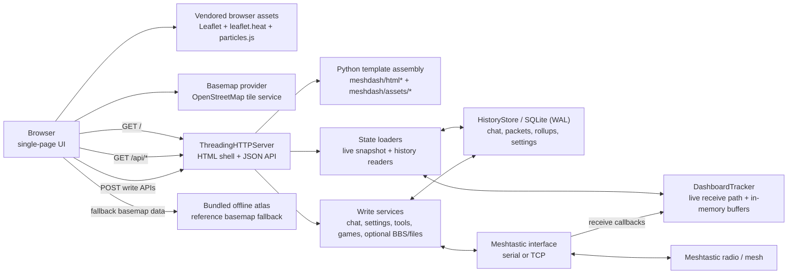

# Meshyface

Meshyface is a chat-first Meshtastic dashboard that runs as a single Python
service and serves a single-page web UI over HTTP.


## Current App Surface

The current UI exposes:

- Chat plus direct-peer conversations
- Network workspace for map, topology, Top 10 rankings, node details, and
  on-demand history views
- Console workspace for live packet/log output
- Apps workspace with Games, plus BBS and Files tabs when those features are
  enabled
- Settings workspace with radio, device, connectivity, location, channels,
  tickers, lists, appearance, and about panes
- SQLite-backed history, search, rollups, theme persistence, and custom
  telemetry rule persistence

### Console workspace

The Console workspace is a terminal-style control surface for packet traffic,
history search, and mesh utility commands.

- Type a command name to open autocomplete suggestions. Use `Tab` or `Enter`
  to accept, `ArrowRight` to accept the ghosted suffix, and `ArrowUp` /
  `ArrowDown` to move through the popup.
- Commands that take a node target show rich node suggestions with name, ID,
  emoji, tag, status, hops, GPS, last-heard state, ports, and node number.
  Normal text narrows by node names and tags; `!` narrows by node ID.
- `live` streams packet traffic until `Ctrl+C` or `q`. Use
  `live grep <text>`, `live rg <text>`, `live filter=<text>`, or bare
  `live <text>` to stream only matching live packet groups. Layer and
  verbosity filters still apply, for example
  `live rg TEXT_MESSAGE_APP -vv --layer=2`.
- `grep <text>` and `rg <text>` search retained packet/chat history with
  context windows, limits, packet/chat source filters, and summary/packet
  scope filters.
- `/search <text>` filters the visible console output from the prompt without
  starting a retained-history search.

## Screenshots

Network workspace views from a live Meshtastic session.

### Live network map


Map view with node locations, links, common paths, clusters, and signal heatmap.

### Network overview


History view for node counts, online status, new nodes, and position reports.

### Link topology


Topology view showing observed links from the selected root node.

### Route trace


Trace view for a source, destination, nearby links, and per-hop packet details.

### Sensor history


Telemetry chart comparing sensor history across multiple nodes.

### Status cards


Top cards for radio activity, node counts, packets, links, battery, and channel
use.

## System Architecture



## Installation

Start with [prerequisites and dependencies](docs/install/prerequisites.md),
then choose one install path:

- [Manual foreground run](docs/install/manual.md): clone anywhere and run the
  dashboard directly.
- [Recommended systemd service](docs/install/systemd.md): clone into
  `/opt/meshyface` for a persistent GitHub-updatable host.
- [Docker](docs/install/docker.md): run the same app entrypoint in a container
  with `/data` mounted for persistent state.
- [Workstation push deployment](docs/install/workstation-push.md): copy a
  local checkout to a target over SSH.
- [Proxmox runtime topology](docs/install/proxmox.md): choose TCP or USB radio
  placement for a VM/LXC install.
- [Offline map packs](docs/install/offline-map-packs.md): add detailed local
  map data for air-gapped or low-connectivity dashboards.

## Data And Storage

### Shared history database

`--history-db` is the final on-disk SQLite filename. The dashboard no longer
adds a connected-radio suffix, so any radio plugged into the dashboard
contributes to the same persisted packet, chat, node, and rollup history.

### History modes

- Default mode persists chat, packets, connection events, node analytics,
  malformed-text records, environment metrics, and summary rollups to SQLite.
- `--no-history` disables the persistent store and keeps only live in-memory
  buffers.
- Summary rollups are also sampled in the background while the dashboard is
  running when history is enabled.

### Theme and local settings

- Theme preset selection persists to
  `mesh_dashboard_theme_settings.json` by default, or the file supplied via
  `--theme-settings-file`.
- Custom telemetry rules are stored in the history SQLite database.
- BBS host settings and local BBS posts are stored in the history SQLite
  database when BBS is enabled.

### Maintenance commands

Operational commands that inspect or repair local dashboard data are documented
in [docs/maintenance.md](docs/maintenance.md).

## Links View Semantics

The `Links` subview is a topology view, not a packet-route replay.

- `History` mode draws from the stored link history saved in SQLite.
- `Live` mode draws from current-session link observations only.
- The numbered rings show shortest graph distance from the current root using a
  breadth-first search over the observed link graph.
- Those ring numbers are not literal Meshtastic forwarding hops and are not a
  real-time packet trace.
- Packet-hop metadata, when available, is still shown separately in node or
  edge details as packet-hop values.

The current root is the node the graph is centered around. Selecting a
different node changes the root and recomputes the numbered distance rings from
that node.

## Configuration Reference

### Connection and transport

- `--mesh-host <ip-or-dns>`: TCP radio host
- `--mesh-tcp-port <port>`: TCP radio port, default `4403`
- `--mesh-port <path>`: serial device path
- `--default-gateway-host <host>`: fallback TCP host if `--mesh-host` is not
  provided and serial is still on the default path
- `--default-gateway-port <port>`: fallback TCP port for
  `--default-gateway-host`
- `--no-default-gateway`: force serial unless `--mesh-host` is explicitly set

Related environment variables:

- `MESH_GATEWAY_HOST`
- `MESH_GATEWAY_PORT`
- `MESH_DASH_MESH_PORT` for the default serial path

### HTTP, UI, and security

- `--http-host <host>`: bind host, default `0.0.0.0`
- `--http-port <port>`: bind port, default `8877`
- `--refresh-ms <ms>`: browser poll interval, default `3000`
- `--packet-limit <n>`: recent live packet buffer size, default `250`
- `--reset-ticker-scale-on-restart` /
  `--no-reset-ticker-scale-on-restart`
- `--show-secrets`: reveal private keys/passwords/PSKs in raw JSON panels
- `--debug-mode` / `--no-debug-mode`: expose debug-only dashboard surfaces such
  as advanced network diagnostics
- `--private-mode` / `--no-private-mode`: strip public chat slices and block
  selected public endpoints
- `--api-token <token>`: require auth on write endpoints via
  `Authorization: Bearer <token>` or `X-API-Token`; prefer
  `MESH_DASH_API_TOKEN` on shared hosts because command-line tokens may appear
  in process listings and shell history
- `--bbs-enable` / `--no-bbs-enable`: expose or hide the BBS/profile workspace
  when `--accept-file-transfer-traffic-disclaimer` is also set
- `--games-enable` / `--no-games-enable`: enable playable Zork console
  endpoints plus mesh bot replies

Related environment variables:

- `MESH_DASH_PRIVATE_MODE`
- `MESH_DASH_API_TOKEN`
- `MESH_DASH_BBS_ENABLE`
- `MESH_DASH_GAMES_ENABLE`
- `MESH_DASH_VERSION`
- `MESH_DASH_GIT_COMMIT`
- `MESH_DASH_PR_NUMBER`

Runtime revision labels and the Software panel version are generated from the
current git commit. Set `MESH_DASH_PR_NUMBER` in PR preview deployments to show
labels like `Rev: PR #43 abc1234`. The `/api/version` `version` field reports
that build ref; `MESH_DASH_VERSION` remains release/package metadata only and is
reported as `package_version`.

### History and analytics

- `--history-db <path>`: base SQLite DB path
- `--history-max-rows <n>`: default `200000`
- `--history-retention-days <days>`: default `30`, use `0` to disable age
  pruning
- `--history-event-max-rows <n>`: append-only packet event cap, default
  `200000`
- `--history-event-retention-days <days>`: default `30`
- `--history-rollup-retention-days <days>`: default `365`
- `--no-history`: memory-only mode
- `--seed-from-node-db`: bootstrap live tracker from the connected radio NodeDB
- `--backfill-environment-rollups`: rebuild environment rollups once and exit;
  see [docs/maintenance.md](docs/maintenance.md)
- `--backfill-environment-rollups-reset`: clear existing rollups before rebuild
- `--node-history-hours <hours>`: default selected-node window, default `72`
- `--node-history-max-points <n>`: max points returned by
  `/api/history/node`, default `1440`

Related environment variables:

- `MESH_DASH_HISTORY_DB`

### Themes

- `--theme-presets <json>`: optional custom theme preset file
- `--theme-preset <name>`: selected preset name
- `--theme-settings-file <json>`: persisted runtime theme selection file

Built-in presets:

- `default` (safe Meshyface blue, particles disabled)
- `custom` (showcase theme with particles and background effects enabled)

Fresh installs default to `default` unless a persisted theme settings file or
`MESH_DASH_THEME_PRESET` selects another preset.

Related environment variables:

- `MESH_DASH_THEME_PRESETS`
- `MESH_DASH_THEME_PRESET`
- `MESH_DASH_THEME_SETTINGS_FILE`


## Security

- This dashboard is intended for trusted LAN/VPN environments.
- Do not expose it directly to the public internet without a reverse proxy and
  access control.
- Use `--private-mode` and/or an API token for stricter write-path control.
- Prefer `MESH_DASH_API_TOKEN` over `--api-token` on shared or multi-user
  hosts. A command-line token can be visible in process listings and retained
  in shell history.
- The built-in `Join Meshyface` channel preset uses an intentionally public
  shared Meshyface PSK for interoperability between users of this software. Do
  not use that public channel for private traffic.
- `--show-secrets` exposes sensitive values in raw JSON panels; do not enable
  it casually on shared displays.
- BBS and file transfer can consume significant mesh airtime. Keep them
  disabled unless you have explicitly accepted that tradeoff.


## Testing And Coverage

Run the normal test suite:

```bash
python -m pytest
```

Run Ruff the same way CI does:

```bash
scripts/run_ruff_local.sh
```

Run the advisory app coverage report:

```bash
python -m pytest \
  --cov=meshdash \
  --cov=mesh_dashboard \
  --cov=mesh_connection \
  --cov-report=term
```

Run the local coverage gate with the stricter 85% minimum:

```bash
scripts/run_coverage_local.sh
```

Run the local GUI responsiveness benchmark before PRs:

```bash
scripts/run_gui_responsiveness_local.sh
```

Coverage intentionally excludes the ported Zork engine package from scoring,
but Zork bot and routing tests still run. GitHub Actions publishes the same
coverage report as an advisory PR comment and artifact, and fails below 80%.
The local gate stays 5 percentage points higher than CI.
