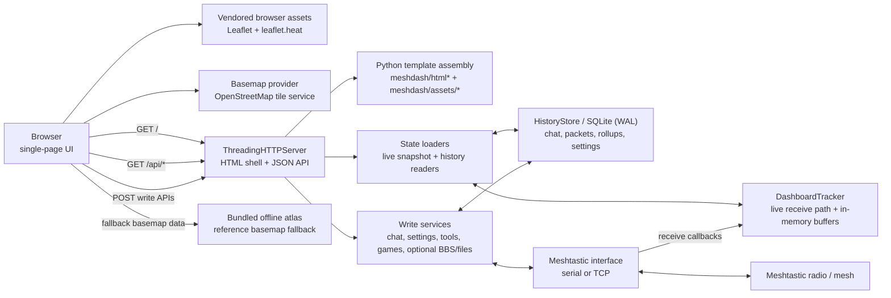

# Meshyface

Meshyface is a chat-first Meshtastic dashboard that runs as a single Python
service and serves a single-page web UI over HTTP.

This repository is the public source home for the curated Meshyface app.
Release candidates should still pass `PUBLICATION_CHECKLIST.md` before tagging
or publishing a new public cut.

## Current App Surface

The current UI exposes:

- Chat workspace for `Everyone` plus direct-peer conversations
- Network workspace for map, topology, Top 10 rankings, node details, and
  on-demand history views
- Console workspace for live packet/log output
- Apps workspace with Games, plus BBS and Files tabs when those features are
  enabled
- Settings workspace with radio, device, connectivity, location, channels,
  tickers, lists, appearance, and about panes
- SQLite-backed history, search, rollups, theme persistence, and custom
  telemetry rule persistence

Not part of the default launcher surface:

- Dedicated Bots or Labs launcher views
- BBS unless `--bbs-enable` is set and the traffic disclaimer is accepted
- Files unless file transfer is enabled and the traffic disclaimer is accepted
- Text-game console/bot endpoints unless `--games-enable` is set
- Network diagnostics unless `--debug-mode` is enabled

The source tree still contains dormant/internal hooks and optional backend
handlers. If an optional backend handler is not wired into the current build,
the corresponding endpoint returns `503`.

## Screenshots

Network workspace views from a live Meshtastic session.

### Live network map


Map view with node locations, links, common paths, clusters, and signal heatmap.

### Network overview


History view for node counts, online status, new nodes, and position reports.

### Link topology


Topology view showing observed links from the selected root node.

### Route trace


Trace view for a source, destination, nearby links, and per-hop packet details.

### Sensor history


Telemetry chart comparing sensor history across multiple nodes.

### Status cards


Top cards for radio activity, node counts, packets, links, battery, and channel
use.

## System Architecture



Key runtime notes:

- `mesh_dashboard.py` owns CLI/env parsing, sideband traffic safety validation,
  default-gateway fallback, and startup mode selection.
- `mesh_connection.py` opens either a Meshtastic serial interface or TCP
  interface.
- The live receive path updates `DashboardTracker` and the in-memory state used
  by `/api/state`.
- `HistoryStore` persists packets, chat, node analytics, connection events,
  summary rollups, and custom telemetry settings to SQLite using WAL mode for
  concurrent reads and writes.
- The browser polls `/api/state`, fetches history/detail endpoints on demand,
  and POSTs write actions for chat, settings, tools, games, and optional BBS.
- The browser loads Leaflet `1.9.4` and leaflet.heat `0.2.0` from vendored
  assets served by the dashboard under `/assets/vendor/`.
- Online basemap mode may request OpenStreetMap tiles from the configured OSM
  tile endpoint.
- Offline atlas mode uses bundled Natural Earth/GeoNames-derived reference
  layers when online tiles are unavailable or when users force offline mode.

## Requirements

- Linux host strongly recommended for server mode
  - Debian-based hosts such as Raspberry Pi OS Bookworm work with the bundled
    deploy helper
- Python 3.11+
- Meshtastic-accessible radio over either:
  - TCP (`--mesh-host` + `--mesh-tcp-port`)
  - Serial USB (`--mesh-port`)
- Python packages:
  - install runtime packages with `python -m pip install -r requirements.txt`
  - install test packages with `python -m pip install -r requirements-dev.txt`
- Browser access to:
  - `https://tile.openstreetmap.org/...` if you want online basemaps

For a fully air-gapped deployment, the vendored Leaflet assets still load
locally, and the map uses the bundled offline atlas when online tile servers
are unavailable.

## Repository Layout

- `mesh_dashboard.py` - entrypoint, CLI/env parsing, startup mode selection
- `mesh_connection.py` - Meshtastic TCP/serial connection handling
- `meshdash/assets/` - HTML/CSS/JS template fragments for the single-page UI
- `meshdash/html*.py` - frontend asset assembly
- `meshdash/http*.py`, `meshdash/api*.py` - HTTP routing and API handlers
- `meshdash/tracker*.py` - receive path, live packet tracking, in-memory state
- `meshdash/history*.py`, `meshdash/history/` - SQLite schema, reads, writes,
  analytics, rollups, pruning
- `scripts/deploy_meshyface.sh` - remote deploy/bootstrap helper
- `scripts/deploy_hotspot.sh` - remote Wi-Fi hotspot + captive landing helper
- `requirements.txt` - runtime Python dependencies
- `requirements-dev.txt` - runtime plus test dependencies
- [docs/](docs/) - maintenance and operator reference pages
- `PUBLICATION_CHECKLIST.md` - required checks before making the repo public
- `THIRD_PARTY_NOTICES.md` - bundled/runtime third-party data and asset notes
- `tests/` - regression tests included in this repo

## Standalone Install

### 1) Clone + venv

```bash
git clone https://github.com/jaronmcd/meshyface.git meshyface
cd meshyface
python3 -m venv .venv
source .venv/bin/activate
python -m pip install --upgrade pip
python -m pip install -r requirements.txt
```

### 2A) Run with Wi-Fi/TCP radio

```bash
python mesh_dashboard.py \
  --mesh-host meshtastic-radio.local \
  --mesh-tcp-port 4403 \
  --http-host 0.0.0.0 \
  --http-port 8877 \
  --refresh-ms 3000
```

### 2B) Run with USB serial radio

```bash
python mesh_dashboard.py \
  --mesh-port /dev/ttyACM0 \
  --http-host 0.0.0.0 \
  --http-port 8877 \
  --refresh-ms 3000
```

Tip: use `/dev/serial/by-id/...` for a stable serial path when possible.

### 2C) Optional: shared TCP gateway fallback

If you want the dashboard to prefer a shared TCP radio when `--mesh-host` is
not supplied and the serial path is left at its default value:

```bash
export MESH_GATEWAY_HOST=meshtastic-radio.local
export MESH_GATEWAY_PORT=4403
python mesh_dashboard.py
```

Disable that fallback explicitly with:

```bash
python mesh_dashboard.py --no-default-gateway
```

### 3) Open UI

- Local: `http://127.0.0.1:8877`
- LAN: `http://<host-ip>:8877`

Run `python mesh_dashboard.py --help` for the authoritative runtime flag list.

## Data And Storage

### Shared history database

`--history-db` is the final on-disk SQLite filename. The dashboard no longer
adds a connected-radio suffix, so any radio plugged into the dashboard
contributes to the same persisted packet, chat, node, and rollup history.

### History modes

- Default mode persists chat, packets, connection events, node analytics,
  malformed-text records, environment metrics, and summary rollups to SQLite.
- `--no-history` disables the persistent store and keeps only live in-memory
  buffers.
- Summary rollups are also sampled in the background while the dashboard is
  running when history is enabled.

### Theme and local settings

- Theme preset selection persists to
  `mesh_dashboard_theme_settings.json` by default, or the file supplied via
  `--theme-settings-file`.
- Custom telemetry rules are stored in the history SQLite database.
- BBS host settings and local BBS posts are stored in the history SQLite
  database when BBS is enabled.

### Maintenance commands

Operational commands that inspect or repair local dashboard data are documented
in [docs/maintenance.md](docs/maintenance.md).

## Links View Semantics

The `Links` subview is a topology view, not a packet-route replay.

- `History` mode draws from the stored link history saved in SQLite.
- `Live` mode draws from current-session link observations only.
- The numbered rings show shortest graph distance from the current root using a
  breadth-first search over the observed link graph.
- Those ring numbers are not literal Meshtastic forwarding hops and are not a
  real-time packet trace.
- Packet-hop metadata, when available, is still shown separately in node or
  edge details as packet-hop values.

The current root is the node the graph is centered around. Selecting a
different node changes the root and recomputes the numbered distance rings from
that node.

## Proxmox And Service Deployment

You have two common deployment models:

1. Proxmox VM/LXC + radio reachable over LAN (TCP) - simplest and most stable
2. Proxmox VM/LXC + USB radio passthrough (serial) - works, but needs device
   passthrough

### Recommended: Proxmox with TCP radio

If your radio is on Wi-Fi/Ethernet and exposes TCP (usually `4403`), run the
dashboard in a VM or container and connect over network.

#### Fast bootstrap/deploy from your workstation

From this repo:

```bash
./scripts/deploy_meshyface.sh \
  --target pi@meshyface.local \
  --bootstrap \
  --mesh-host meshtastic-radio.local \
  --mesh-port 4403 \
  --clean-app-dir
```

This installs the runtime, deploys app files, writes `dashboard.env`, and
restarts the service.

Bootstrap assumptions:

- target host has `apt-get`, `systemd`, `ssh`, and `sudo`
- target Python must be `3.11+` after bootstrap; Raspberry Pi OS Bookworm is a
  good baseline
- when you do not override `MESH_DASH_DEPLOY_ROOT`, the deploy helper now uses
  the remote login user's home and installs under `<remote-home>/mesh`
- the generated service unit uses the remote login user by default and keeps
  `dialout` as the default service group for serial-access-friendly installs

Important naming note:

- In the runtime CLI, the TCP radio port flag is `--mesh-tcp-port`.
- In `scripts/deploy_meshyface.sh` and the bundled `dashboard.env`,
  `MESH_PORT` is the TCP port for historical reasons.

#### Update loop

```bash
./scripts/deploy_meshyface.sh \
  --target pi@meshyface.local \
  --mesh-host meshtastic-radio.local \
  --mesh-port 4403 \
  --clean-app-dir
```

#### Full reset + redeploy

If you want to remove the current Meshyface install on the target and rebuild it
from scratch in one step, use `--wipe-remote-root`. This removes the managed
systemd unit plus the deploy root, then bootstraps fresh:

```bash
./scripts/deploy_meshyface.sh \
  --target pi@meshyface.local \
  --wipe-remote-root \
  --serial-path /dev/serial/by-id/usb-Silicon_Labs_CP2102_USB_to_UART_Bridge_Controller_0001-if00-port0
```

`--wipe-remote-root` implies `--bootstrap`.

#### Full uninstall + hard reboot

If you want to remove Meshyface from the Pi and stop there:

```bash
./scripts/deploy_meshyface.sh \
  --target pi@meshyface.local \
  --uninstall \
  --hard-reboot
```

That removes:

- `/etc/systemd/system/meshtastic-dashboard.service`
- the managed deploy root, which defaults to `/home/<ssh-user>/mesh`
- any managed app/config/log/venv/history paths that were explicitly configured
  outside the deploy root

`--hard-reboot` can also be used after a normal deploy if you want the host to
come back from a forced reboot instead of just restarting the service.

#### Raspberry Pi target

For a Raspberry Pi running Raspberry Pi OS Bookworm or newer, the same
bootstrap flow works as long as the SSH user has `sudo` access:

```bash
./scripts/deploy_meshyface.sh \
  --target pi@raspberrypi.local \
  --bootstrap \
  --mesh-host meshtastic-radio.local \
  --mesh-port 4403 \
  --clean-app-dir
```

That will default to:

- app root: `/home/pi/mesh`
- service user: `pi`
- service group: `dialout`

If the Pi has a radio attached over USB serial instead of TCP, use the stable
`/dev/serial/by-id/...` path:

```bash
./scripts/deploy_meshyface.sh \
  --target pi@raspberrypi.local \
  --bootstrap \
  --serial-path /dev/serial/by-id/usb-Silicon_Labs_CP2102_USB_to_UART_Bridge_Controller_0001-if00-port0 \
  --clean-app-dir
```

### Raspberry Pi hotspot + captive landing page

If you want the Pi itself to broadcast Wi-Fi and send hotspot clients to
Meshyface as the landing page, use the bundled hotspot deploy helper:

```bash
./scripts/deploy_hotspot.sh \
  --target pi@raspberrypi.local \
  --ssid Meshyface \
  --password 'replace-with-a-strong-passphrase'
```

Default behavior:

- configures a NetworkManager AP profile (`MeshyfaceAP`) on `wlan0`
- enables `ipv4.method=shared` with AP CIDR `10.42.0.1/24`
- writes `/etc/NetworkManager/dnsmasq-shared.d/90-meshyface-captive.conf` so
  hotspot DNS names resolve to `10.42.0.1`
- installs/configures Nginx landing rules for common captive probe paths
  (`/generate_204`, `/hotspot-detect.html`, `/ncsi.txt`, `/connecttest.txt`)
- redirects HTTP requests to `http://10.42.0.1:8877/`

Useful variants:

```bash
# Custom subnet/landing IP/port
./scripts/deploy_hotspot.sh \
  --target pi@raspberrypi.local \
  --ap-cidr 10.77.0.1/24 \
  --landing-ip 10.77.0.1 \
  --dash-port 8877

# Remove hotspot + captive config managed by the script
./scripts/deploy_hotspot.sh \
  --target pi@raspberrypi.local \
  --uninstall
```

Environment overrides are also supported:

- `MESH_DASH_HOTSPOT_TARGET`
- `MESH_DASH_HOTSPOT_IFACE`
- `MESH_DASH_HOTSPOT_CONNECTION`
- `MESH_DASH_HOTSPOT_SSID`
- `MESH_DASH_HOTSPOT_PASSWORD`
- `MESH_DASH_HOTSPOT_AP_CIDR`
- `MESH_DASH_HOTSPOT_LANDING_IP`
- `MESH_DASH_HOTSPOT_DASH_PORT`
- `MESH_DASH_HOTSPOT_BAND`
- `MESH_DASH_HOTSPOT_CHANNEL`
- `MESH_DASH_HOTSPOT_DNS_CATCHALL`

### Proxmox with USB serial radio

#### VM path

- In Proxmox GUI: VM -> Hardware -> Add -> USB Device
- Boot VM and confirm device appears:

```bash
ls -l /dev/ttyACM* /dev/ttyUSB* 2>/dev/null
ls -l /dev/serial/by-id 2>/dev/null
```

#### LXC path (advanced)

For LXC, pass the serial device from host into the container config. Typical
pattern:

- allow the character device
- bind-mount `/dev/ttyACM0` or `/dev/ttyUSB0` into the container

After passthrough, verify the same `ls` commands inside the container.

### Run as systemd service (TCP)

The included `meshtastic-dashboard.service` is an example service file for a
host laid out under `/opt/meshyface`. Adjust `User`, `Group`, paths, and serial
permissions to match your host.

The bootstrap path in `scripts/deploy_meshyface.sh` does not copy that example
verbatim anymore. It renders a host-specific unit from the resolved deploy
settings, including the remote root, app/config paths, venv path, service user,
and service group.

It reads env from `/opt/meshyface/config/dashboard.env`.

Example env:

```bash
cat > /opt/meshyface/config/dashboard.env <<'EOF_ENV'
MESH_HOST=meshtastic-radio.local
MESH_PORT=4403
DASH_HOST=0.0.0.0
DASH_PORT=8877
REFRESH_MS=3000
MESH_DASH_HISTORY_DB=/opt/meshyface/mesh_dashboard_history.sqlite3
MESH_DASH_BBS_ENABLE=0
MESH_DASH_GAMES_ENABLE=0
MESH_DASH_FILE_TRANSFER_ENABLE=0
MESH_DASH_FILE_TRANSFER_AUTO_ACCEPT=0
MESH_DASH_FILE_TRANSFER_MAX_BYTES=65536
MESH_DASH_ACCEPT_FILE_TRANSFER_TRAFFIC_DISCLAIMER=0
PYTHONUNBUFFERED=1
EOF_ENV
```

Start/restart:

```bash
sudo systemctl daemon-reload
sudo systemctl enable --now meshtastic-dashboard
sudo systemctl restart meshtastic-dashboard
sudo systemctl status meshtastic-dashboard --no-pager
```

### Run as systemd service (serial)

For serial mode, override `ExecStart` to use `--mesh-port` instead of
`--mesh-host`.

Quick override:

```bash
sudo systemctl edit meshtastic-dashboard
```

Drop-in contents:

```ini
[Service]
ExecStart=
ExecStart=/opt/meshyface/.venv/bin/python /opt/meshyface/app/mesh_dashboard.py --mesh-port /dev/ttyACM0 --http-host ${DASH_HOST} --http-port ${DASH_PORT} --refresh-ms ${REFRESH_MS}
```

Then:

```bash
sudo systemctl daemon-reload
sudo systemctl restart meshtastic-dashboard
```

Also ensure the service user can access the serial device, usually via the
`dialout` group.

### BBS and file transfer safety gate

BBS and file transfer are hidden/disabled by default. Each must be enabled at
startup and both require the traffic disclaimer:

- `--file-transfer-enable` or `MESH_DASH_FILE_TRANSFER_ENABLE=1`
- `--bbs-enable` or `MESH_DASH_BBS_ENABLE=1`
- `--accept-file-transfer-traffic-disclaimer` or
  `MESH_DASH_ACCEPT_FILE_TRANSFER_TRAFFIC_DISCLAIMER=1`

Optional file-transfer size cap:

- `--file-transfer-max-bytes <bytes>` or
  `MESH_DASH_FILE_TRANSFER_MAX_BYTES=<bytes>`
- Valid range is clamped to `1024` .. `512000` bytes

Optional received-file acceptance default:

- `--file-transfer-auto-accept` / `--no-file-transfer-auto-accept` or
  `MESH_DASH_FILE_TRANSFER_AUTO_ACCEPT=1|0`
- When enabled, the backend accepts and ACKs direct inbound transfers even if
  no browser tab is open
- The Files view toggle persists per browser and overrides the browser-side
  default for that browser; it does not disable backend auto accept set at
  startup

Deploy helper example:

```bash
./scripts/deploy_meshyface.sh \
  --target pi@meshyface.local \
  --mesh-host meshtastic-radio.local \
  --file-transfer-enable \
  --file-transfer-max-bytes 512000 \
  --accept-file-transfer-traffic-disclaimer \
  --clean-app-dir
```

`scripts/deploy_meshyface.sh` preserves existing BBS/file-transfer env values
from the target `dashboard.env` unless you explicitly pass feature flags or env
overrides.

### BBS profile workspace

The BBS/profile workspace is also hidden by default. To enable it:

- `--bbs-enable` or `MESH_DASH_BBS_ENABLE=1`
- `--accept-file-transfer-traffic-disclaimer` or
  `MESH_DASH_ACCEPT_FILE_TRANSFER_TRAFFIC_DISCLAIMER=1`

Deploy helper example:

```bash
./scripts/deploy_meshyface.sh \
  --target pi@meshyface.local \
  --mesh-host meshtastic-radio.local \
  --bbs-enable \
  --accept-file-transfer-traffic-disclaimer \
  --clean-app-dir
```

`scripts/deploy_meshyface.sh` preserves the existing BBS and disclaimer values
from the target `dashboard.env` unless you explicitly pass feature flags or env
overrides.

## Configuration Reference

### Connection and transport

- `--mesh-host <ip-or-dns>`: TCP radio host
- `--mesh-tcp-port <port>`: TCP radio port, default `4403`
- `--mesh-port <path>`: serial device path
- `--default-gateway-host <host>`: fallback TCP host if `--mesh-host` is not
  provided and serial is still on the default path
- `--default-gateway-port <port>`: fallback TCP port for
  `--default-gateway-host`
- `--no-default-gateway`: force serial unless `--mesh-host` is explicitly set

Related environment variables:

- `MESH_GATEWAY_HOST`
- `MESH_GATEWAY_PORT`
- `MESH_DASH_MESH_PORT` for the default serial path

### HTTP, UI, and security

- `--http-host <host>`: bind host, default `0.0.0.0`
- `--http-port <port>`: bind port, default `8877`
- `--refresh-ms <ms>`: browser poll interval, default `3000`
- `--packet-limit <n>`: recent live packet buffer size, default `250`
- `--reset-ticker-scale-on-restart` /
  `--no-reset-ticker-scale-on-restart`
- `--show-secrets`: reveal private keys/passwords/PSKs in raw JSON panels
- `--debug-mode` / `--no-debug-mode`: expose debug-only dashboard surfaces such
  as advanced network diagnostics
- `--private-mode` / `--no-private-mode`: strip public chat slices and block
  selected public endpoints
- `--api-token <token>`: require auth on write endpoints via
  `Authorization: Bearer <token>` or `X-API-Token`
- `--bbs-enable` / `--no-bbs-enable`: expose or hide the BBS/profile workspace
  when `--accept-file-transfer-traffic-disclaimer` is also set
- `--games-enable` / `--no-games-enable`: enable playable Zork console
  endpoints plus mesh bot replies

Related environment variables:

- `MESH_DASH_PRIVATE_MODE`
- `MESH_DASH_API_TOKEN`
- `MESH_DASH_BBS_ENABLE`
- `MESH_DASH_GAMES_ENABLE`
- `MESH_DASH_VERSION`
- `MESH_DASH_GIT_COMMIT`

### History and analytics

- `--history-db <path>`: base SQLite DB path
- `--history-max-rows <n>`: default `200000`
- `--history-retention-days <days>`: default `30`, use `0` to disable age
  pruning
- `--history-event-max-rows <n>`: append-only packet event cap, default
  `200000`
- `--history-event-retention-days <days>`: default `30`
- `--history-rollup-retention-days <days>`: default `365`
- `--no-history`: memory-only mode
- `--seed-from-node-db`: bootstrap live tracker from the connected radio NodeDB
- `--backfill-environment-rollups`: rebuild environment rollups once and exit;
  see [docs/maintenance.md](docs/maintenance.md)
- `--backfill-environment-rollups-reset`: clear existing rollups before rebuild
- `--node-history-hours <hours>`: default selected-node window, default `72`
- `--node-history-max-points <n>`: max points returned by
  `/api/history/node`, default `1440`

Related environment variables:

- `MESH_DASH_HISTORY_DB`

### Themes

- `--theme-presets <json>`: optional custom theme preset file
- `--theme-preset <name>`: selected preset name
- `--theme-settings-file <json>`: persisted runtime theme selection file

Built-in presets:

- `default`
- `blue`
- `custom`

Fresh installs default to `custom` unless a persisted theme settings file or
`MESH_DASH_THEME_PRESET` selects another preset.

Related environment variables:

- `MESH_DASH_THEME_PRESETS`
- `MESH_DASH_THEME_PRESET`
- `MESH_DASH_THEME_SETTINGS_FILE`

### BBS and file transfer

- `--bbs-enable` / `--no-bbs-enable`
- `--file-transfer-enable` / `--no-file-transfer-enable`
- `--file-transfer-auto-accept` / `--no-file-transfer-auto-accept`
- `--file-transfer-max-bytes <bytes>`
- `--accept-file-transfer-traffic-disclaimer` /
  `--no-accept-file-transfer-traffic-disclaimer`

Related environment variables:

- `MESH_DASH_FILE_TRANSFER_ENABLE`
- `MESH_DASH_FILE_TRANSFER_AUTO_ACCEPT`
- `MESH_DASH_FILE_TRANSFER_MAX_BYTES`
- `MESH_DASH_ACCEPT_FILE_TRANSFER_TRAFFIC_DISCLAIMER`

### Service/deploy helper environment

The bundled service/deploy flow commonly uses:

- `MESH_HOST`
- `MESH_PORT` for the TCP radio port used by the service file
- `MESH_SERIAL_PATH` for generated serial-mode service units
- `DASH_HOST`
- `DASH_PORT`
- `REFRESH_MS`
- `MESH_DASH_HISTORY_DB`
- `MESH_DASH_BBS_ENABLE`
- `MESH_DASH_GAMES_ENABLE`
- `MESH_DASH_FILE_TRANSFER_ENABLE`
- `MESH_DASH_FILE_TRANSFER_AUTO_ACCEPT`
- `MESH_DASH_FILE_TRANSFER_MAX_BYTES`
- `MESH_DASH_ACCEPT_FILE_TRANSFER_TRAFFIC_DISCLAIMER`
- `PYTHONUNBUFFERED`

The deploy helper also accepts:

- `MESH_DASH_DEPLOY_TARGET`
- `MESH_DASH_DEPLOY_ROOT`
- `MESH_DASH_DEPLOY_APP_DIR`
- `MESH_DASH_DEPLOY_CONFIG_DIR`
- `MESH_DASH_DEPLOY_LOG_DIR`
- `MESH_DASH_DEPLOY_REMOTE_VENV`
- `MESH_DASH_DEPLOY_REMOTE_PYTHON`
- `MESH_DASH_DEPLOY_SERVICE`
- `MESH_DASH_DEPLOY_SERVICE_USER`
- `MESH_DASH_DEPLOY_SERVICE_GROUP`
- `MESH_DASH_DEPLOY_CLEAN_APP_DIR`
- `MESH_DASH_DEPLOY_WIPE_REMOTE_ROOT`
- `MESH_DASH_DEPLOY_UNINSTALL`
- `MESH_DASH_DEPLOY_HARD_REBOOT`
- `MESH_DASH_DEPLOY_MESH_HOST`
- `MESH_DASH_DEPLOY_MESH_PORT`
- `MESH_DASH_DEPLOY_SERIAL_PATH`
- `MESH_DASH_DEPLOY_DASH_HOST`
- `MESH_DASH_DEPLOY_DASH_PORT`
- `MESH_DASH_DEPLOY_REFRESH_MS`
- `MESH_DASH_DEPLOY_HISTORY_DB`
- `MESH_DASH_DEPLOY_PYTHON_UNBUFFERED`
- `MESH_DASH_DEPLOY_BBS_ENABLE`
- `MESH_DASH_DEPLOY_FILE_TRANSFER_ENABLE`
- `MESH_DASH_DEPLOY_FILE_TRANSFER_AUTO_ACCEPT`
- `MESH_DASH_DEPLOY_FILE_TRANSFER_MAX_BYTES`
- `MESH_DASH_DEPLOY_ACCEPT_FILE_TRANSFER_TRAFFIC_DISCLAIMER`

## HTTP And Ops Endpoints

### Core read endpoints

- `/` - HTML shell
- `/api/health` - runtime health summary
- `/api/version` - version, commit, and revision label
- `/metrics` - Prometheus text metrics
- `/api/state` - main UI polling payload

### Raw/debug endpoints

- `/api/raw/my_info`
- `/api/raw/metadata`
- `/api/raw/local_state`
- `/api/raw/nodes_full`

### History and analytics endpoints

- `/api/history/node`
- `/api/history/online`
- `/api/history/summary`
- `/api/history/top_nodes`
- `/api/history/environment`
- `/api/history/malformed`
- `/api/history/search`

### UI support endpoints

- `/api/settings/theme`
- `/api/settings/bbs`
- `/api/bbs/host`
- `/api/settings/custom_telemetry`
- `/api/offline/atlas`
- `/api/chat/emoji-catalog`

### Write endpoints

- `/api/chat/send`
- `/api/settings/radio`
- `/api/settings/channels`
- `/api/settings/theme`
- `/api/settings/bbs`
- `/api/bbs/host`
- `/api/settings/custom_telemetry`
- `/api/tools/network`
- `/api/games/zork`

Write-path rules:

- If `--api-token` is set, token-protected write endpoints require
  `Authorization: Bearer <token>` or `X-API-Token`.
- `--private-mode` blocks public chat send, history search, emoji catalog, and
  selected tools/game endpoints. It also strips public chat slices from
  `/api/state`.
- Optional endpoints can return `503` if the corresponding module is not wired
  into the current build.

## Operations And Troubleshooting

Service health:

```bash
sudo systemctl status meshtastic-dashboard --no-pager
sudo journalctl -u meshtastic-dashboard -f
```

HTTP health/version/metrics:

```bash
curl -s http://127.0.0.1:8877/api/health
curl -s http://127.0.0.1:8877/api/version
curl -s http://127.0.0.1:8877/metrics
```

If serial mode fails:

```bash
ls -l /dev/ttyACM* /dev/ttyUSB* 2>/dev/null
ls -l /dev/serial/by-id 2>/dev/null
groups
```

If the UI loads but the map styling or map logic is broken, verify that the
dashboard is serving the vendored Leaflet assets under `/assets/vendor/`. If the
map base layer is blank but the rest of the UI is healthy, the tile servers may
be unreachable and the offline atlas fallback should be used instead. The
bundled atlas can be rebuilt with
`python scripts/build_offline_atlas.py --source-dir /path/to/natural-earth-zips`.

If the UI looks stale after deploy, hard refresh the browser with
`Ctrl+Shift+R`.

## Testing

Install test dependencies, then run the regression suite:

```bash
python -m pip install -r requirements-dev.txt
python -m pytest -q
```

## Publication Status

The repository is intended to be public. Before tagging a release or changing
publication state, complete `PUBLICATION_CHECKLIST.md` and verify the
third-party notes in `THIRD_PARTY_NOTICES.md`.

## Security

- This dashboard is intended for trusted LAN/VPN environments.
- Do not expose it directly to the public internet without a reverse proxy and
  access control.
- Use `--private-mode` and/or `--api-token` for stricter write-path control.
- The built-in `Join Meshyface` channel preset uses an intentionally public
  shared Meshyface PSK for interoperability between users of this software. Do
  not use that public channel for private traffic.
- `--show-secrets` exposes sensitive values in raw JSON panels; do not enable
  it casually on shared displays.
- BBS and file transfer can consume significant mesh airtime. Keep them
  disabled unless you have explicitly accepted that tradeoff.
