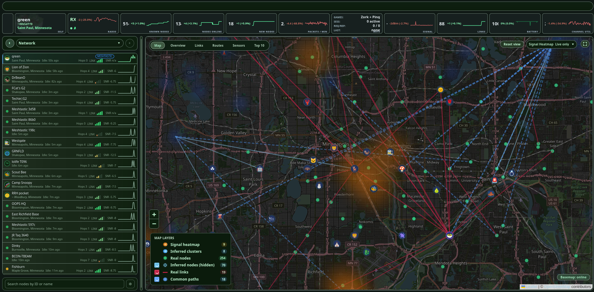
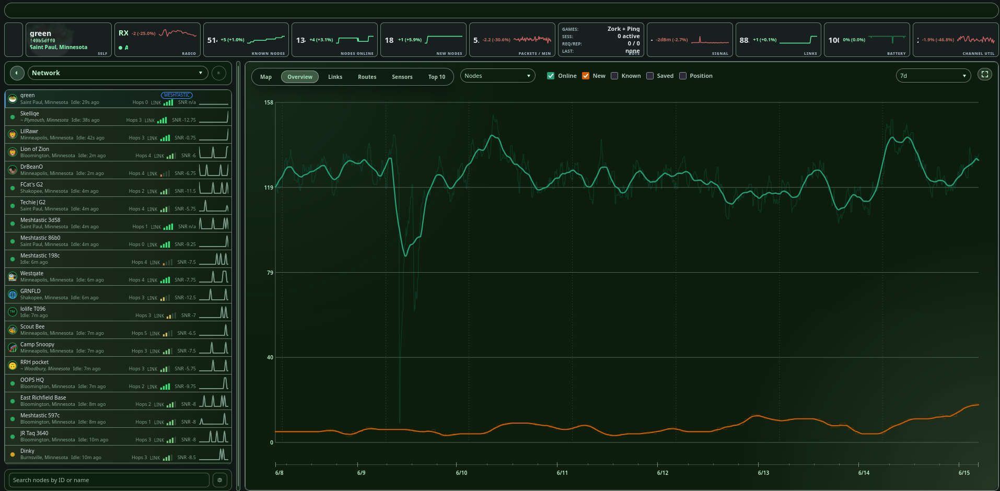
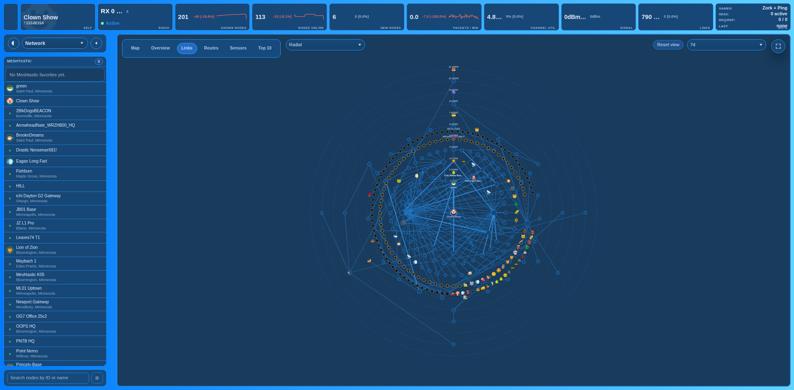
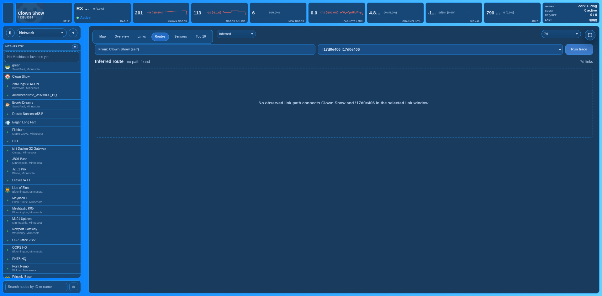
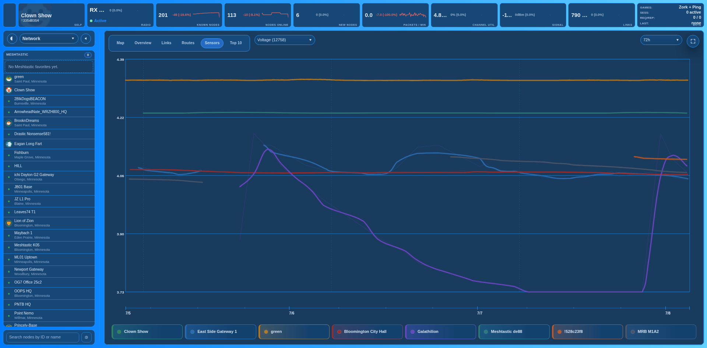
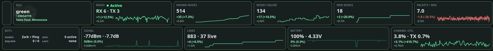
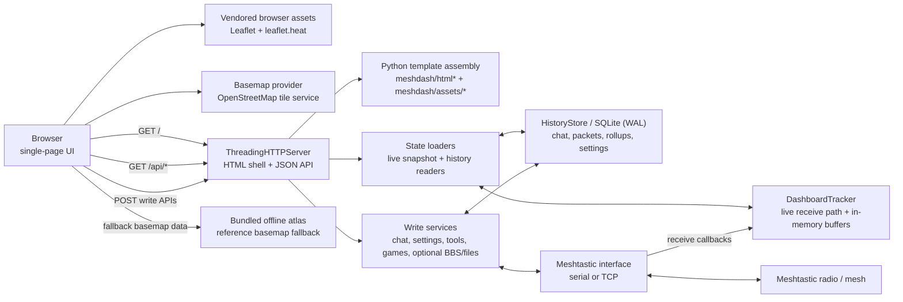

# Meshyface

Meshyface is a chat-first Meshtastic dashboard that runs as a single Python
service and serves a single-page web UI over HTTP.


## Current App Surface

The current UI exposes:

- Chat plus direct-peer conversations
- Network workspace for map, topology, Top 10 rankings, node details, and
  on-demand history views
- Console workspace for live packet/log output
- Apps workspace with Games, plus BBS and Files tabs when those features are
  enabled
- Settings workspace with radio, device, connectivity, location, channels,
  tickers, lists, appearance, and about panes
- SQLite-backed history, search, rollups, theme persistence, and custom
  telemetry rule persistence

### Console workspace

The Console workspace is a terminal-style control surface for packet traffic,
history search, and mesh utility commands.

- Type a command name to open autocomplete suggestions. Use `Tab` or `Enter`
  to accept, `ArrowRight` to accept the ghosted suffix, and `ArrowUp` /
  `ArrowDown` to move through the popup.
- Commands that take a node target show rich node suggestions with name, ID,
  emoji, tag, status, hops, GPS, last-heard state, ports, and node number.
  Normal text narrows by node names and tags; `!` narrows by node ID.
- `live` streams packet traffic until `Ctrl+C` or `q`. Use
  `live grep <text>`, `live rg <text>`, `live filter=<text>`, or bare
  `live <text>` to stream only matching live packet groups. Layer and
  verbosity filters still apply, for example
  `live rg TEXT_MESSAGE_APP -vv --layer=2`.
- `grep <text>` and `rg <text>` search retained packet/chat history with
  context windows, limits, packet/chat source filters, and summary/packet
  scope filters.
- `/search <text>` filters the visible console output from the prompt without
  starting a retained-history search.

## Screenshots

Network workspace views from a live Meshtastic session.

### Live network map



Map view with node locations, links, common paths, clusters, and signal heatmap.

### Network overview



History view for node counts, online status, new nodes, and position reports.

### Link topology



Topology view showing observed links from the selected root node.

### Route trace



Trace view for a source, destination, nearby links, and per-hop packet details.

### Sensor history



Telemetry chart comparing sensor history across multiple nodes.

### Status cards



Top cards for radio activity, node counts, packets, links, battery, and channel
use.

## System Architecture



## Prerequisites And Dependencies

Meshyface is a Python web service. For a persistent dashboard host, use Linux
with systemd; Debian, Ubuntu, and Raspberry Pi OS Bookworm or newer are the
expected paths.

Required host packages for the standalone install:

```bash
sudo apt-get update
sudo apt-get install -y git python3 python3-venv
```

Runtime requirements:

- Python `3.11+`
- outbound HTTPS during install for GitHub and PyPI, unless dependencies are
  already mirrored or cached
- a Meshtastic radio reachable over TCP (`--mesh-host` + `--mesh-tcp-port`) or
  USB serial (`--mesh-port`)
- for USB serial, a stable `/dev/serial/by-id/...` path is recommended
- for USB serial under systemd, the service user must have access to the serial
  device; the documented unit uses group `dialout`

Python runtime packages are pinned in `requirements.txt`:

- `meshtastic==2.7.8`
- `pypubsub==4.0.7`
- `protobuf==7.34.1`

Install them with:

```bash
python -m pip install -r requirements.txt
```

Development and test dependencies live in `requirements-dev.txt`:

```bash
python -m pip install -r requirements-dev.txt
```

Browser access to `https://tile.openstreetmap.org/...` is only needed for
online basemaps.

For a fully air-gapped deployment, the vendored Leaflet assets still load
locally, and the map uses the bundled offline atlas when online tile servers
are unavailable.

## Offline And Custom Map Data

Meshyface includes a small bundled offline atlas as a fallback basemap. For
more detail, build or install offline map packs on the dashboard host. Map packs
are local GeoJSON chunks served by the dashboard; the browser does not need
internet access after they are installed.

Use the Console workspace command `mappacks` for a live, mesh-sized build
command. It suggests a center/radius from current node GPS positions and prints
the matching install command for that host.

Common CLI workflow:

```bash
# Preview a regional pack around stored node history.
python scripts/build_map_pack.py --source-dir map_sources --download \
  --from-history --estimate

# Build a custom pack around stored node history.
python scripts/build_map_pack.py --source-dir map_sources --download \
  --from-history --pack-id mymesh --zip mymesh.zip

# Install it into the dashboard's map pack directory.
python scripts/install_map_pack.py mymesh --zip mymesh.zip
```

Regional packs can also use `--region "Minnesota"` or an explicit
`--center LAT,LON --radius-km KM`. Use `--layers` or `--exclude-layers` to keep
the pack small. The peaks layer uses GeoNames country dumps; for remote areas
where country inference is empty, pass `--peaks-countries US` or omit peaks
with `--exclude-layers peaks`.

Installed packs appear in Settings -> Maps. Source downloads and build outputs
use local `map_sources/` and `map_pack_build/` directories, which are ignored by
git.

## Standalone Install

Choose one install path:

- Manual run: clone into your home directory or any working directory and run
  the dashboard in the foreground.
- Systemd service: clone into `/opt/meshyface` and use the included service
  unit. This is the recommended path for persistent hosts.

You do not need both checkouts.

### Manual Foreground Run

Use this for a quick foreground run. If you are setting up the systemd service,
skip to [Recommended Service Install](#recommended-service-install) and use the
`/opt/meshyface` clone path there.

Clone and create the virtual environment:

```bash
git clone https://github.com/jaronmcd/meshyface.git meshyface
cd meshyface
python3 -m venv .venv
source .venv/bin/activate
python -m pip install --upgrade pip
python -m pip install -r requirements.txt
```

Run with Wi-Fi/TCP radio:

```bash
python mesh_dashboard.py \
  --mesh-host 192.168.1.42 \
  --mesh-tcp-port 4403 \
  --http-host 0.0.0.0 \
  --http-port 8877 \
  --refresh-ms 3000
```

Note: replace `192.168.1.42` with the Wi-Fi IP address of your radio.

Run with USB serial radio:

```bash
python mesh_dashboard.py \
  --mesh-port /dev/ttyACM0 \
  --http-host 0.0.0.0 \
  --http-port 8877 \
  --refresh-ms 3000
```

Tip: use `/dev/serial/by-id/...` for a stable serial path when possible.


Open the UI:

- Local: `http://127.0.0.1:8877`
- LAN: `http://<host-ip>:8877`

Run `python mesh_dashboard.py --help` for the authoritative runtime flag list.

## Recommended Service Install

This is the preferred public GitHub install path for persistent hosts. It keeps
the dashboard as a normal git checkout, so the Software panel in Settings can
check GitHub branches and apply git-based updates. If you want to push a local
checkout from a workstation over SSH instead, use the deploy helper in
[Workstation Push Deployment](#workstation-push-deployment).

The `/opt/meshyface` path is a system-wide install convention for the included
service unit. It is not special to the app, but the commands below and
`meshtastic-dashboard.service` assume this layout:

- repo clone: `/opt/meshyface`
- virtualenv: `/opt/meshyface/.venv`
- environment file: `/etc/meshyface/dashboard.env`
- writable app data: `/var/lib/meshyface`
- service user/group: `meshyface` / `dialout`

If you clone somewhere else, update every `/opt/meshyface` path in the service
unit and commands. For the copy/paste install below, clone directly into
`/opt/meshyface`; do not also create a separate `~/meshyface` checkout unless
you want a personal test copy.

On a Debian, Ubuntu, or Raspberry Pi OS host:

```bash
sudo apt-get update
sudo apt-get install -y git python3 python3-venv
sudo useradd --system --create-home --groups dialout meshyface || true
sudo install -d -o meshyface -g dialout /opt/meshyface
sudo -u meshyface git clone https://github.com/jaronmcd/meshyface.git /opt/meshyface
sudo -u meshyface python3 -m venv /opt/meshyface/.venv
sudo -u meshyface /opt/meshyface/.venv/bin/python -m pip install --upgrade pip
sudo -u meshyface /opt/meshyface/.venv/bin/python -m pip install -r /opt/meshyface/requirements.txt
sudo install -d -o root -g dialout -m 0750 /etc/meshyface
sudo install -d -o meshyface -g dialout -m 0750 /var/lib/meshyface
```

For a Wi-Fi/TCP radio, create `/etc/meshyface/dashboard.env` with:

```bash
sudo tee /etc/meshyface/dashboard.env >/dev/null <<'EOF'
MESH_GATEWAY_HOST=192.168.1.42
MESH_GATEWAY_PORT=4403
MESH_DASH_HISTORY_DB=/var/lib/meshyface/mesh_dashboard_history.sqlite3
MESH_DASH_THEME_SETTINGS_FILE=/var/lib/meshyface/mesh_dashboard_theme_settings.json
PYTHONUNBUFFERED=1
EOF
sudo chown root:dialout /etc/meshyface/dashboard.env
sudo chmod 0640 /etc/meshyface/dashboard.env
```

For a USB serial radio, use this `dashboard.env` instead:

```bash
sudo tee /etc/meshyface/dashboard.env >/dev/null <<'EOF'
MESH_DASH_MESH_PORT=/dev/serial/by-id/usb-Silicon_Labs_CP2102_USB_to_UART_Bridge_Controller_0001-if00-port0
MESH_DASH_HISTORY_DB=/var/lib/meshyface/mesh_dashboard_history.sqlite3
MESH_DASH_THEME_SETTINGS_FILE=/var/lib/meshyface/mesh_dashboard_theme_settings.json
PYTHONUNBUFFERED=1
EOF
sudo chown root:dialout /etc/meshyface/dashboard.env
sudo chmod 0640 /etc/meshyface/dashboard.env
```

Then install and start the service:

```bash
cd /opt/meshyface
sudo install -m 0644 meshtastic-dashboard.service /etc/systemd/system/meshtastic-dashboard.service
sudo systemctl daemon-reload
sudo systemctl enable --now meshtastic-dashboard
sudo systemctl status meshtastic-dashboard --no-pager -l
```

After pulling updates:

```bash
cd /opt/meshyface
sudo -u meshyface git pull --ff-only
sudo -u meshyface /opt/meshyface/.venv/bin/python -m pip install -r requirements.txt
sudo systemctl restart meshtastic-dashboard
```

To uninstall this systemd layout and remove its managed data:

```bash
sudo systemctl disable --now meshtastic-dashboard.service 2>/dev/null || true
sudo systemctl stop meshtastic-dashboard.service 2>/dev/null || true
sudo rm -f /etc/systemd/system/meshtastic-dashboard.service
sudo rm -f /etc/systemd/system/multi-user.target.wants/meshtastic-dashboard.service
sudo systemctl daemon-reload
sudo systemctl reset-failed meshtastic-dashboard.service 2>/dev/null || true

sudo rm -rf /opt/meshyface
sudo rm -rf /etc/meshyface
sudo rm -rf /var/lib/meshyface

if getent passwd meshyface >/dev/null; then
  sudo userdel -r meshyface 2>/dev/null || sudo userdel meshyface
fi
sudo rm -rf /home/meshyface
```

If you also made a separate test checkout under your login user's home, remove
that checkout separately, for example `rm -rf ~/meshyface`.

## Docker Install

The Docker image runs the same `mesh_dashboard.py` entrypoint as the standalone
install. It stores SQLite history and theme settings under `/data` by default,
so mount a volume there if you want state to survive container replacement.

### Build image

```bash
docker build -t meshyface:local .
```

### Run with Wi-Fi/TCP radio

```bash
docker run --rm -it \
  -p 8877:8877 \
  -v meshyface-data:/data \
  -e MESH_GATEWAY_HOST=meshtastic-radio.local \
  -e MESH_GATEWAY_PORT=4403 \
  meshyface:local
```

Then open `http://127.0.0.1:8877`.

### Run with USB serial radio

```bash
docker run --rm -it \
  -p 8877:8877 \
  -v meshyface-data:/data \
  --device /dev/ttyACM0:/dev/ttyACM0 \
  -e MESH_DASH_MESH_PORT=/dev/ttyACM0 \
  meshyface:local
```

Use a stable `/dev/serial/by-id/...` host path when possible. Map it to a
container path such as `/dev/ttyACM0`, then set `MESH_DASH_MESH_PORT` to that
container path.

### Docker Compose

For a TCP radio:

```bash
MESH_GATEWAY_HOST=meshtastic-radio.local docker compose --profile tcp up -d --build
```

For a USB serial radio:

```bash
MESH_DASH_MESH_PORT=/dev/ttyACM0 docker compose --profile serial up -d --build
```

The Compose file publishes `8877`, uses the named volume `meshyface-data`, and
keeps optional BBS, games, and file-transfer features disabled unless you enable
their documented environment variables.

## Data And Storage

### Shared history database

`--history-db` is the final on-disk SQLite filename. The dashboard no longer
adds a connected-radio suffix, so any radio plugged into the dashboard
contributes to the same persisted packet, chat, node, and rollup history.

### History modes

- Default mode persists chat, packets, connection events, node analytics,
  malformed-text records, environment metrics, and summary rollups to SQLite.
- `--no-history` disables the persistent store and keeps only live in-memory
  buffers.
- Summary rollups are also sampled in the background while the dashboard is
  running when history is enabled.

### Theme and local settings

- Theme preset selection persists to
  `mesh_dashboard_theme_settings.json` by default, or the file supplied via
  `--theme-settings-file`.
- Custom telemetry rules are stored in the history SQLite database.
- BBS host settings and local BBS posts are stored in the history SQLite
  database when BBS is enabled.

### Maintenance commands

Operational commands that inspect or repair local dashboard data are documented
in [docs/maintenance.md](docs/maintenance.md).

## Links View Semantics

The `Links` subview is a topology view, not a packet-route replay.

- `History` mode draws from the stored link history saved in SQLite.
- `Live` mode draws from current-session link observations only.
- The numbered rings show shortest graph distance from the current root using a
  breadth-first search over the observed link graph.
- Those ring numbers are not literal Meshtastic forwarding hops and are not a
  real-time packet trace.
- Packet-hop metadata, when available, is still shown separately in node or
  edge details as packet-hop values.

The current root is the node the graph is centered around. Selecting a
different node changes the root and recomputes the numbered distance rings from
that node.

## Proxmox Runtime Topology

You have two common deployment models:

1. Proxmox VM/LXC + radio reachable over LAN (TCP) - simplest and most stable
2. Proxmox VM/LXC + USB radio passthrough (serial) - works, but needs device
   passthrough

### Recommended: Proxmox with TCP radio

If your radio is on Wi-Fi/Ethernet and exposes TCP (usually `4403`), run the
dashboard in a VM or container and connect over network. Use the standalone
systemd install or Docker install above inside that VM/container.

## Workstation Push Deployment

For public installs, prefer the standalone clone plus systemd flow above. The
Settings Software panel expects the running app to be a git checkout when you
want in-app GitHub updates.

`scripts/deploy_meshyface.sh` is a workstation-managed push deploy helper. It
copies the local checkout over SSH, renders a target-specific systemd unit, and
can bootstrap or reset a host. It is useful when:

- the target should not or cannot clone from GitHub directly
- you are pushing local, unreleased changes
- you want a one-command Raspberry Pi or Proxmox bootstrap from your workstation
- you need the reset/uninstall flows built into the helper

It is not a fully offline installer. During `--bootstrap` it still uses the
target host's package manager and `pip` unless those dependencies are already
provisioned. A deploy-helper-managed app directory is also a copied payload, not
a git checkout, so update those hosts by rerunning the helper instead of using
the in-app git updater.

### Push bootstrap/deploy from your workstation

From this repo:

```bash
./scripts/deploy_meshyface.sh \
  --target pi@meshyface.local \
  --bootstrap \
  --mesh-host meshtastic-radio.local \
  --mesh-port 4403 \
  --clean-app-dir
```

This installs the runtime, deploys app files from your local checkout, writes
`dashboard.env`, and restarts the service.

Bootstrap assumptions:

- target host has `apt-get`, `systemd`, `ssh`, and `sudo`
- target Python must be `3.11+` after bootstrap; Raspberry Pi OS Bookworm is a
  good baseline
- when you do not override `MESH_DASH_DEPLOY_ROOT`, the deploy helper now uses
  the remote login user's home and installs under `<remote-home>/mesh`
- the generated service unit uses the remote login user by default and keeps
  `dialout` as the default service group for serial-access-friendly installs

Important naming note:

- In the runtime CLI, the TCP radio port flag is `--mesh-tcp-port`.
- In `scripts/deploy_meshyface.sh` and the bundled `dashboard.env`,
  `MESH_PORT` is the TCP port for historical reasons.

### Update loop

```bash
./scripts/deploy_meshyface.sh \
  --target pi@meshyface.local \
  --mesh-host meshtastic-radio.local \
  --mesh-port 4403 \
  --clean-app-dir
```

### Full reset + redeploy

If you want to remove the current Meshyface install on the target and rebuild it
from scratch in one step, use `--wipe-remote-root`. This removes the managed
systemd unit plus the deploy root, then bootstraps fresh:

```bash
./scripts/deploy_meshyface.sh \
  --target pi@meshyface.local \
  --wipe-remote-root \
  --serial-path /dev/serial/by-id/usb-Silicon_Labs_CP2102_USB_to_UART_Bridge_Controller_0001-if00-port0
```

`--wipe-remote-root` implies `--bootstrap`.

### Full uninstall + hard reboot

If you want to remove Meshyface from the Pi and stop there:

```bash
./scripts/deploy_meshyface.sh \
  --target pi@meshyface.local \
  --uninstall \
  --hard-reboot
```

That removes:

- `/etc/systemd/system/meshtastic-dashboard.service`
- the managed deploy root, which defaults to `/home/<ssh-user>/mesh`
- any managed app/config/log/venv/history paths that were explicitly configured
  outside the deploy root

`--hard-reboot` can also be used after a normal deploy if you want the host to
come back from a forced reboot instead of just restarting the service.

### Raspberry Pi target

For a Raspberry Pi running Raspberry Pi OS Bookworm or newer, the same
bootstrap flow works as long as the SSH user has `sudo` access:

```bash
./scripts/deploy_meshyface.sh \
  --target pi@raspberrypi.local \
  --bootstrap \
  --mesh-host meshtastic-radio.local \
  --mesh-port 4403 \
  --clean-app-dir
```

That will default to:

- app root: `/home/pi/mesh`
- service user: `pi`
- service group: `dialout`

If the Pi has a radio attached over USB serial instead of TCP, use the stable
`/dev/serial/by-id/...` path:

```bash
./scripts/deploy_meshyface.sh \
  --target pi@raspberrypi.local \
  --bootstrap \
  --serial-path /dev/serial/by-id/usb-Silicon_Labs_CP2102_USB_to_UART_Bridge_Controller_0001-if00-port0 \
  --clean-app-dir
```

## Configuration Reference

### Connection and transport

- `--mesh-host <ip-or-dns>`: TCP radio host
- `--mesh-tcp-port <port>`: TCP radio port, default `4403`
- `--mesh-port <path>`: serial device path
- `--default-gateway-host <host>`: fallback TCP host if `--mesh-host` is not
  provided and serial is still on the default path
- `--default-gateway-port <port>`: fallback TCP port for
  `--default-gateway-host`
- `--no-default-gateway`: force serial unless `--mesh-host` is explicitly set

Related environment variables:

- `MESH_GATEWAY_HOST`
- `MESH_GATEWAY_PORT`
- `MESH_DASH_MESH_PORT` for the default serial path

### HTTP, UI, and security

- `--http-host <host>`: bind host, default `0.0.0.0`
- `--http-port <port>`: bind port, default `8877`
- `--refresh-ms <ms>`: browser poll interval, default `3000`
- `--packet-limit <n>`: recent live packet buffer size, default `250`
- `--reset-ticker-scale-on-restart` /
  `--no-reset-ticker-scale-on-restart`
- `--show-secrets`: reveal private keys/passwords/PSKs in raw JSON panels
- `--debug-mode` / `--no-debug-mode`: expose debug-only dashboard surfaces such
  as advanced network diagnostics
- `--private-mode` / `--no-private-mode`: strip public chat slices and block
  selected public endpoints
- `--api-token <token>`: require auth on write endpoints via
  `Authorization: Bearer <token>` or `X-API-Token`; prefer
  `MESH_DASH_API_TOKEN` on shared hosts because command-line tokens may appear
  in process listings and shell history
- `--bbs-enable` / `--no-bbs-enable`: expose or hide the BBS/profile workspace
  when `--accept-file-transfer-traffic-disclaimer` is also set
- `--games-enable` / `--no-games-enable`: enable playable Zork console
  endpoints plus mesh bot replies

Related environment variables:

- `MESH_DASH_PRIVATE_MODE`
- `MESH_DASH_API_TOKEN`
- `MESH_DASH_BBS_ENABLE`
- `MESH_DASH_GAMES_ENABLE`
- `MESH_DASH_VERSION`
- `MESH_DASH_GIT_COMMIT`
- `MESH_DASH_PR_NUMBER`

Runtime revision labels are generated from the current git commit. Set
`MESH_DASH_PR_NUMBER` in PR preview deployments to show labels like
`Rev: PR #43 abc1234`; `MESH_DASH_VERSION` remains a release/package version
override rather than a per-PR bump requirement.

### History and analytics

- `--history-db <path>`: base SQLite DB path
- `--history-max-rows <n>`: default `200000`
- `--history-retention-days <days>`: default `30`, use `0` to disable age
  pruning
- `--history-event-max-rows <n>`: append-only packet event cap, default
  `200000`
- `--history-event-retention-days <days>`: default `30`
- `--history-rollup-retention-days <days>`: default `365`
- `--no-history`: memory-only mode
- `--seed-from-node-db`: bootstrap live tracker from the connected radio NodeDB
- `--backfill-environment-rollups`: rebuild environment rollups once and exit;
  see [docs/maintenance.md](docs/maintenance.md)
- `--backfill-environment-rollups-reset`: clear existing rollups before rebuild
- `--node-history-hours <hours>`: default selected-node window, default `72`
- `--node-history-max-points <n>`: max points returned by
  `/api/history/node`, default `1440`

Related environment variables:

- `MESH_DASH_HISTORY_DB`

### Themes

- `--theme-presets <json>`: optional custom theme preset file
- `--theme-preset <name>`: selected preset name
- `--theme-settings-file <json>`: persisted runtime theme selection file

Built-in presets:

- `default`
- `blue`
- `custom`

Fresh installs default to `custom` unless a persisted theme settings file or
`MESH_DASH_THEME_PRESET` selects another preset.

Related environment variables:

- `MESH_DASH_THEME_PRESETS`
- `MESH_DASH_THEME_PRESET`
- `MESH_DASH_THEME_SETTINGS_FILE`


## Security

- This dashboard is intended for trusted LAN/VPN environments.
- Do not expose it directly to the public internet without a reverse proxy and
  access control.
- Use `--private-mode` and/or an API token for stricter write-path control.
- Prefer `MESH_DASH_API_TOKEN` over `--api-token` on shared or multi-user
  hosts. A command-line token can be visible in process listings and retained
  in shell history.
- The built-in `Join Meshyface` channel preset uses an intentionally public
  shared Meshyface PSK for interoperability between users of this software. Do
  not use that public channel for private traffic.
- `--show-secrets` exposes sensitive values in raw JSON panels; do not enable
  it casually on shared displays.
- BBS and file transfer can consume significant mesh airtime. Keep them
  disabled unless you have explicitly accepted that tradeoff.


## Testing And Coverage

Run the normal test suite with:

```bash
python -m pytest
```

Run the advisory app coverage report with:

```bash
python -m pytest \
  --cov=meshdash \
  --cov=mesh_dashboard \
  --cov=mesh_connection \
  --cov-report=term
```

Run the local coverage gate with the stricter 85% minimum:

```bash
scripts/run_coverage_local.sh
```

Coverage intentionally excludes the ported Zork engine package from scoring,
but Zork bot and routing tests still run. GitHub Actions publishes the same
coverage report as an advisory PR comment and artifact, and fails below 80%.
The local gate stays 5 percentage points higher than CI.
